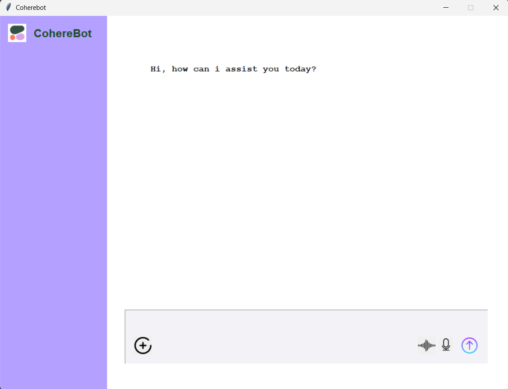

# Coherebot

**Coherebot** é um assistente de voz construído em Python, com interface gráfica em Tkinter. Ele combina reconhecimento de voz, processamento de linguagem natural e síntese de voz para interagir com o utilizador de forma eficiente.



## Tecnologias

- **Python 3**
- **Tkinter** — Interface gráfica
- **speech_recognition** — Reconhecimento de fala
- **pyttsx3** — Síntese de voz
- **Cohere API** — Geração de respostas com IA
- **threading** — Execução de tarefas em paralelo

## Funcionalidades

- Reconhecimento de comandos de voz
- Geração de respostas com linguagem natural via Cohere
- Leitura em voz alta com `pyttsx3`
- Interface gráfica simples e funcional
- Uso de `threading` para evitar bloqueios na interface

## Instalação

```bash
git clone https://github.com/jrdimande/coherebot-mz.git
pip install -r requirements.txt
python main.py
````
## Contribuições

Se quiseres melhorar o projeto, estás à vontade!

Podes:
- Corrigir erros
- Sugerir novas funcionalidades
- Melhorar o código ou a interface

Para isso, faz um fork, edita e envia um pull request. Toda ajuda é bem-vinda. 🙂

## 📄 Licença

Este projeto está licenciado sob a Licença MIT.

